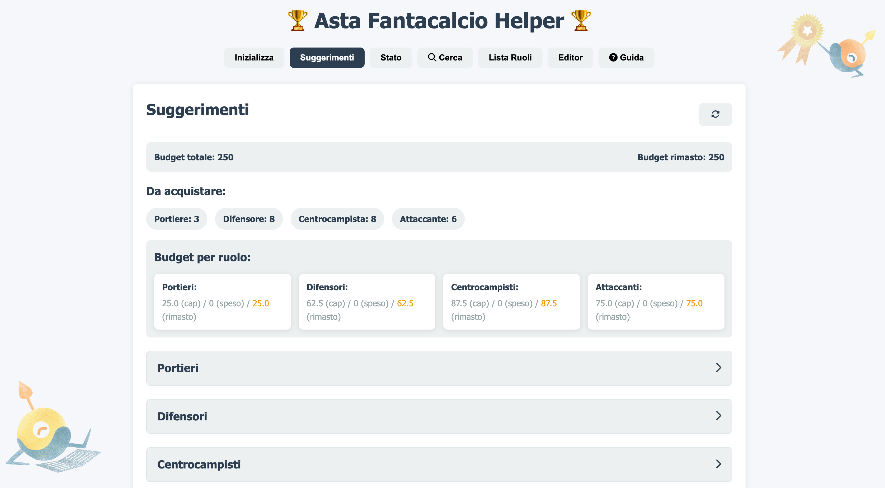

# 🏆 Asta Fantacalcio Helper 

Un codeployer vibe tool per gestire l'asta del fantacalcio!
Il codeployer non è esperto di fantacalcio. Gli piace giocare a pallone, ma quando si tratta di fantamercato...va un po' in difficoltà.

Per questo motivo vibecodando prima dell'asta ha creato questo piccolo tool. Uno strumentino da usare durante l'asta del fantacalcio per segnare i giocatori acquistati e creare la propria squadra al meglio (o quasi).



## 🚀 Come iniziare

### Avvio con server Node.js (consigliato)

1. Installa le dipendenze:
   ```bash
   npm install
   ```

2. Avvia il server:
   ```bash
   npm start
   ```

3. Visita `http://localhost:3000` nel tuo browser

## 📋 Funzionalità

Ecco le funzionalità che puoi usare in questo piccolo tool.

### 1. Inizializzazione
- Carica un file CSV con i giocatori
- Imposta il budget totale
- Configura il numero di suggerimenti da visualizzare

### 2. Suggerimenti
- Visualizza i migliori giocatori per ogni ruolo in base allo score calcolato
- Alterna tra suggerimenti standard e ottimizzati per budget/cap
- Acquista o segna come non disponibili i giocatori direttamente dalla lista

### 3. Stato
- Visualizza il budget totale e residuo
- Controlla il bilanciamento della squadra con indicatore visivo
- Gestisci la tua rosa attuale
- Tieni traccia dei giocatori non disponibili e degli avversari
- Aggiungi nuovi acquisti o segna giocatori come acquistati da altri
- Gestione automatica della redistribuzione del budget in eccesso

### 4. Cerca
- Cerca i giocatori disponibili per nome, squadra, ruolo
- Personalizza il numero di giocatori da visualizzare
- Acquista o segna come non disponibili i giocatori direttamente dalla lista

### 5. Lista per Ruolo
- Visualizza i migliori giocatori per un ruolo specifico
- Personalizza il numero di giocatori da visualizzare
- Acquista o segna come non disponibili i giocatori direttamente dalla lista

### 6. Editor
- Modifica i giocatori direttamente dalla lista
- Aggiungi nuovi giocatori
- Modifica i giocatori esistenti
- Elimina i giocatori

## 💰 Gestione del budget

L'applicazione include un sistema avanzato di gestione del budget per ruolo:

### Redistribuzione automatica del budget
- Quando sfori il cap di budget in un ruolo, l'eccesso viene redistribuito
- La redistribuzione avviene solo sui ruoli in cui non hai ancora acquistato giocatori
- I ruoli con budget ridistribuito sono contrassegnati con un asterisco (*)
- Passando il mouse sull'asterisco viene mostrato un tooltip esplicativo

### Suggerimenti ottimizzati
- I suggerimenti "ottimizzati" tengono conto del budget ridistribuito
- Questo garantisce che i giocatori suggeriti siano effettivamente acquistabili
- Il sistema evita di suggerirti giocatori che causerebbero uno sforamento eccessivo

## 💾 Salvataggio dati

L'applicazione salva automaticamente lo stato in due modi:

- I dati vengono salvati nel localStorage del browser
- I dati vengono salvati anche su disco nel file `app/data/fantacalcio_state.json`
- Il salvataggio su disco avviene automaticamente ad ogni modifica
- Il caricamento da disco avviene all'avvio dell'applicazione

### 📊 Struttura del progetto

```
asta-fantacalcio/
├── app/
│   ├── app.js           # Logica principale dell'applicazione
│   ├── index.html       # Interfaccia utente
│   ├── styles.css       # Stili CSS
│   ├── server.js        # Server Express per il salvataggio su disco
│   ├── package.json     # Dipendenze Node.js
│   └── data/
│       ├── giocatori.csv   # File CSV di esempio
│       └── fantacalcio_state.json # File di stato salvato
└── README.md        # Documentazione
```


## 📊 Algoritmo di Score

Lo score di ogni giocatore viene calcolato come di seguito indicato:

```
score = zscore(FVMP per ruolo) + bonus UNDER + priorità(P) + peso * MyScore
```

Dove:
- **FVMP** → valore ufficiale della lega
- **z-score** → normalizza i FVMP all'interno del ruolo
- **Bonus UNDER** → preferenza per i giovani (U21:+0.10, U23:+0.07, ecc.)
- **Priorità (P)** → 1 = target massimo
- **MyScore (S)** → voto personale (es. 1–10)
